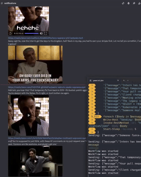

# SaaS - Sopranos as a Service

A Vercel Edge Function that analyzes your notifications, picks the most fitting Sopranos character based on the message's sentiment, rewrites them in that character's voice, and posts them to Discord with matching GIFs.

[](https://vercel.com/new/clone?repository-url=https%3A%2F%2Fgithub.com%2FBrettKinny%2Fsaas&env=OPENROUTER_API_KEY&envDescription=API%20keys%20needed%20for%20SaaS&envLink=https%3A%2F%2Fopenrouter.ai%2Fkeys)



## Features

- Analyzes message sentiment via Claude Sonnet to pick the best-matching character:
  - Tony Soprano — authority, power, leadership issues
  - Paulie Walnuts — paranoia, suspicion, conspiracy
  - Christopher Moltisanti — drama, existential crises, creative problems
  - Silvio Dante — strategic issues, loyalty, being pulled back into things
  - Uncle Junior — disrespect, old-school gripes, health complaints
  - Bobby Baccalieri — gentle problems, food, wholesome concerns
- Rewrites the message in that character's voice via LLM
- Searches Tenor for relevant Sopranos GIFs based on character and message severity
- Posts to Discord webhooks with character avatars and embedded GIFs
- Severity-based color coding (critical=red, error=light red, warning=orange, info=blue)
- Falls back to random character selection if no API key is configured

## API Endpoint

### POST /api/notify

Analyze a notification's sentiment, pick the best-matching Sopranos character, rewrite the message in their voice, and post to Discord.

**Headers:**
- `x-saas-destination` (required): Discord webhook URL

**Body (JSON):**
```json
{
  "message": "Server CPU usage at 95%",
  "source": "monitoring-system",
  "severity": "critical"
}
```

**Fields:**
- `message` (required): The notification message to rewrite
- `source` (optional): Source of the notification (shown in embed footer)
- `severity` (optional): One of `info`, `warning`, `error`, `critical`

**Example Request:**
```bash
curl -X POST https://your-deployment.vercel.app/api/notify \
  -H "Content-Type: application/json" \
  -H "x-saas-destination: https://discord.com/api/webhooks/YOUR_WEBHOOK_ID/YOUR_WEBHOOK_TOKEN" \
  -d '{
    "message": "Database connection pool exhausted",
    "source": "postgres-monitor",
    "severity": "error"
  }'
```

**Response:**
```json
{
  "success": true,
  "character": "Tony Soprano",
  "originalMessage": "Database connection pool exhausted",
  "rewrittenMessage": "Whaddya gonna do? The database connections are all used up. It's like the garbage business - sometimes you run outta trucks.",
  "gifUrl": "https://media.tenor.com/..."
}
```

## Environment Variables

Set these in your Vercel project settings:

| Variable | Required | Description |
|----------|----------|-------------|
| `OPENROUTER_API_KEY` | No | API key from [OpenRouter](https://openrouter.ai/keys). Without it, character selection is random and messages get a catchphrase prefix instead of a full rewrite. |
| `TENOR_API_KEY` | No | API key from [Tenor](https://developers.google.com/tenor/guides/quickstart). Has public fallback. |

## Deployment

1. Install Vercel CLI: `npm i -g vercel`
2. Clone this repository
3. Run `vercel` to deploy
4. Set environment variables in Vercel dashboard

## Local Development

```bash
npm install
cp .env.example .env.local
# Edit .env.local with your API keys
npm run dev
```

## Discord Webhook Setup

1. Go to your Discord server settings
2. Navigate to Integrations > Webhooks
3. Click "New Webhook"
4. Copy the webhook URL
5. Use it in the `x-saas-destination` header

## License

MIT
